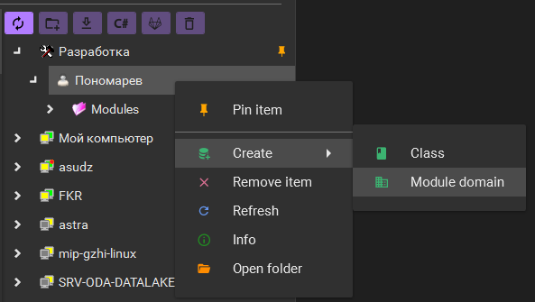
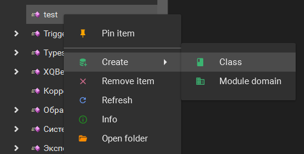
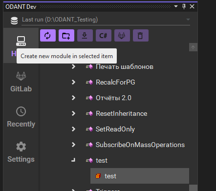
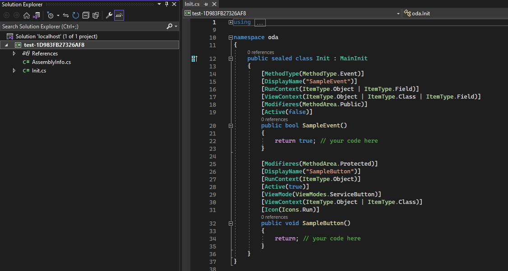

##**Для начала разработки требуется:**
1. Создать локальный сервер
2. Создать домен разработчика на локальном сервере и выбрать его во вкладке настройки (Settings)

## **Удаленная разработка**
1. Поддерживается разработка модулей, хранящихся **только на локальном** сервере.  
2. Для изменение модулей с удаленного хоста требуется скопировать класс с модулем локально (возможно на вкладке Hosts)

## **Создание первого модуля**
1. 
2. 
3. 
4. 